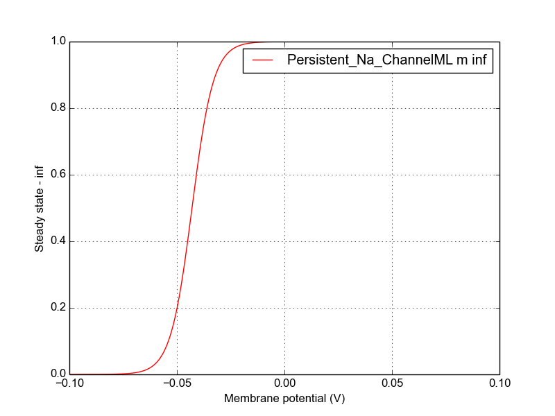
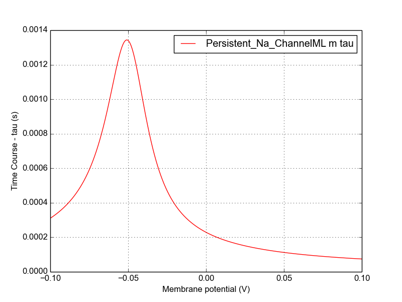
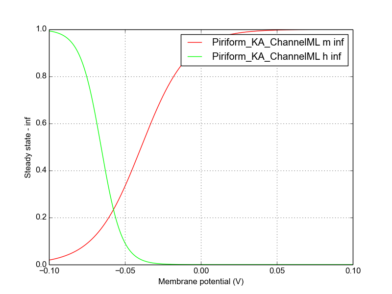
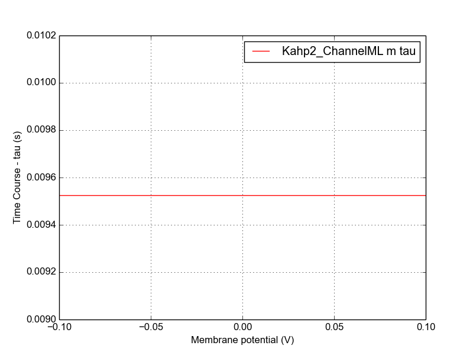
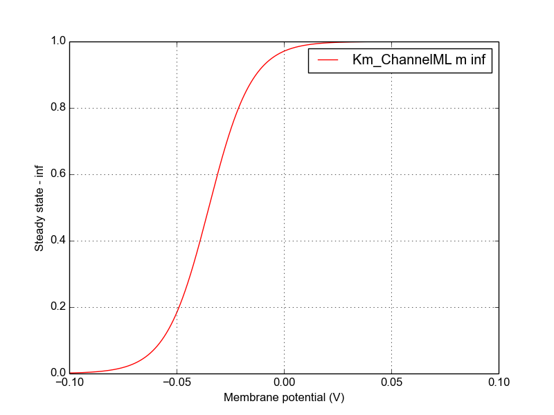
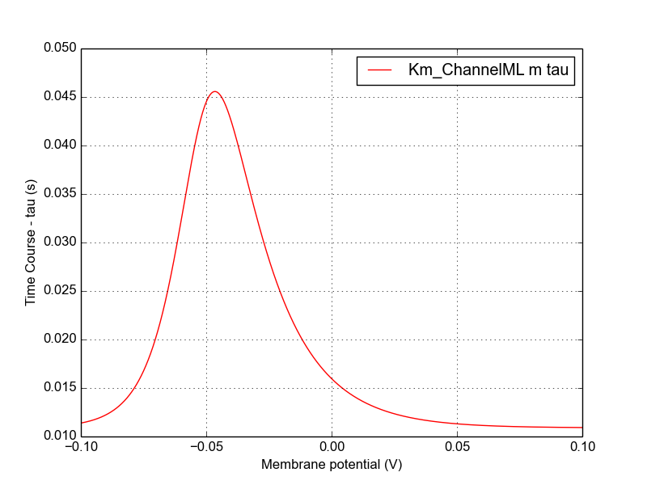

Channel information
===================
    

Channel information at: T = 6.3 degC, E_rev = 0 mV, [Ca2+] = 5e-05 mM

<table>
    <tr>
<td width="120px">
            
<b>Na_Hippo_ChannelML</b> 
            <a href="../Na_Hippo_ChannelML.channel.nml">Na_Hippo_ChannelML.channel.nml</a>  
            Ion: na  
            g = gmax * m2 * h   
            Hippocampal Na channel in Vanier and Bower (1999) 

</td>
<td>

</td>
<td>

</td>
</tr>
    <tr>
<td width="120px">
            
<b>Persistent_Na_ChannelML</b> 
            <a href="../Persistent_Na_ChannelML.channel.nml">Persistent_Na_ChannelML.channel.nml</a>  
            Ion: na  
            g = gmax * m   
            Persistent Na channel in Vanier and Bower (1999) based on implementation in McCormick and Huguenard (1992) 

</td>
<td>

</td>
<td>

</td>
</tr>
    <tr>
<td width="120px">
            
<b>KDR_Hippo_ChannelML</b> 
            <a href="../KDR_Hippo_ChannelML.channel.nml">KDR_Hippo_ChannelML.channel.nml</a>  
            Ion: k  
            g = gmax * n   
            Simple example of K conductance in M. C. Vanier and J. M. Bower, A Comparative Survey of Automated Parameter-Searching Methods for Compartmental Neural Models 

</td>
<td>

</td>
<td>

</td>
</tr>
    <tr>
<td width="120px">
            
<b>Piriform_KA_ChannelML</b> 
            <a href="../Piriform_KA_ChannelML.channel.nml">Piriform_KA_ChannelML.channel.nml</a>  
            Ion: k  
            g = gmax * m3 * h   
            A-type K channel, with rate equations expressed in tau and inf form 

</td>
<td>

</td>
<td>

</td>
</tr>
    <tr>
<td width="120px">
            
<b>Olfactory_Ca_ChannelML</b> 
            <a href="../Olfactory_Ca_ChannelML.channel.nml">Olfactory_Ca_ChannelML.channel.nml</a>  
            Ion: ca  
            g = gmax * m * h   
            A-type K channel, with rate equations expressed in tau and inf form 

</td>
<td>

</td>
<td>

</td>
</tr>
    <tr>
<td width="120px">
            
<b>Kahp1_ChannelML</b> 
            <a href="../Kahp1_ChannelML.channel.nml">Kahp1_ChannelML.channel.nml</a>  
            Ion: kahp  
            g = gmax * m   
            Calcium concentration dependent K+ channel 

</td>
<td>

</td>
<td>

</td>
</tr>
    <tr>
<td width="120px">
            
<b>Kahp2_ChannelML</b> 
            <a href="../Kahp2_ChannelML.channel.nml">Kahp2_ChannelML.channel.nml</a>  
            Ion: kahp  
            g = gmax * m   
            Calcium concentration dependent K+ channel 

</td>
<td>

</td>
<td>

</td>
</tr>
    <tr>
<td width="120px">
            
<b>Km_ChannelML</b> 
            <a href="../Km_ChannelML.channel.nml">Km_ChannelML.channel.nml</a>  
            Ion: km  
            g = gmax * m   
            Non inactivating Muscarinic type K channel, with rate equations expressed in tau and inf form 

</td>
<td>

</td>
<td>

</td>
</tr>
</table>

